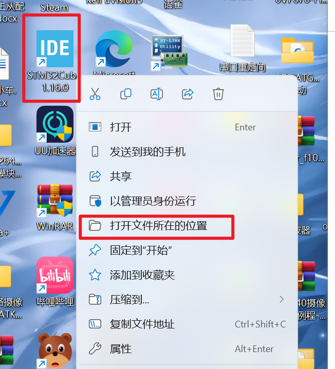
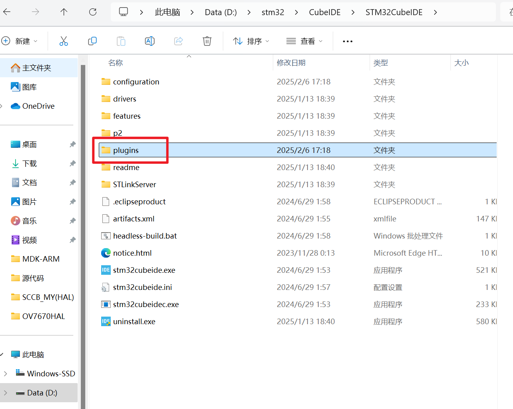
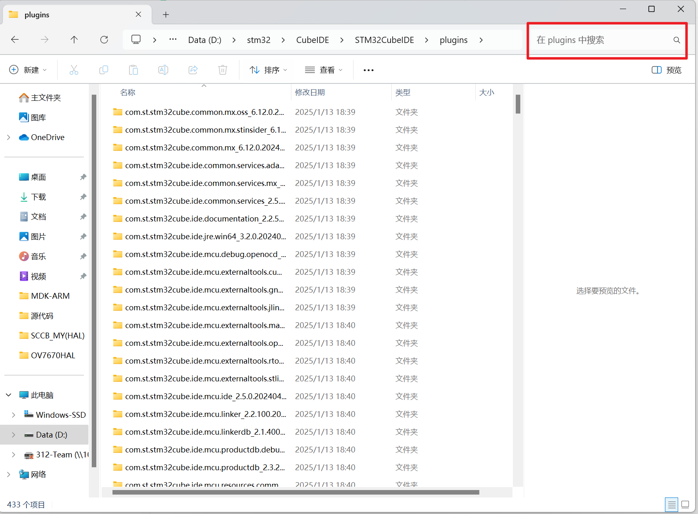
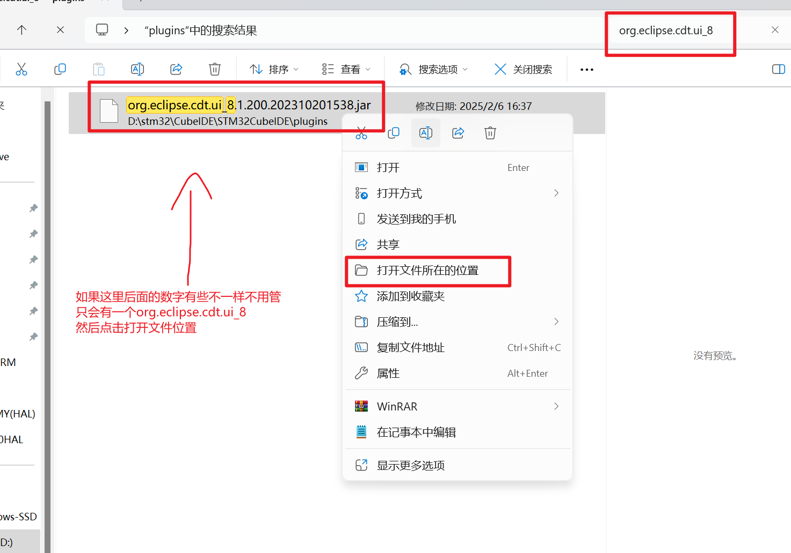
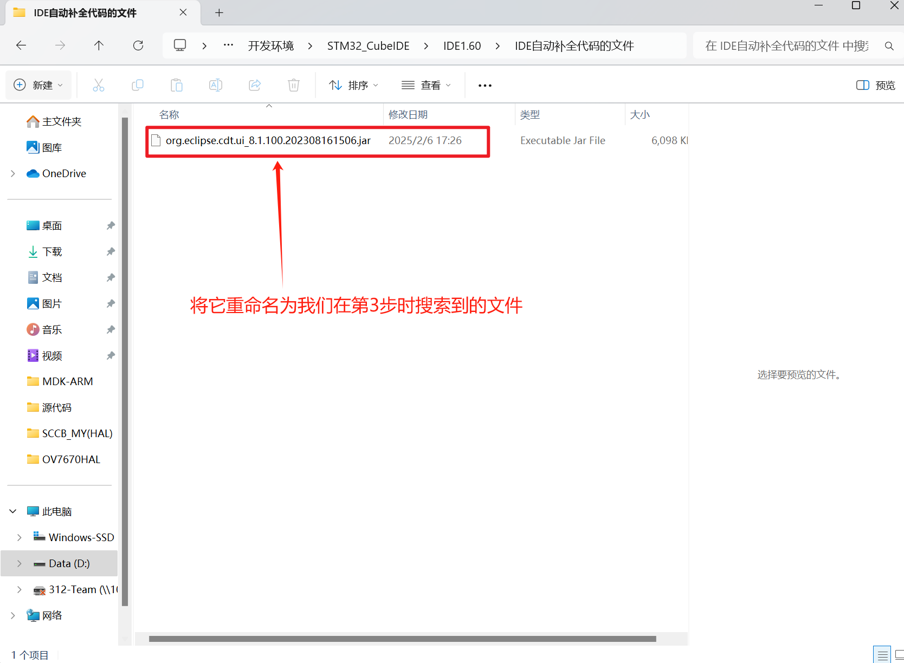
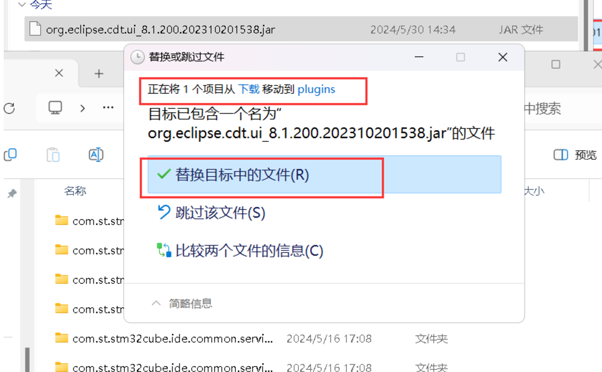

在IDE中自动代码补全:
1.找到IDE文件目录

2.然后点击：

3.搜索这个  org.eclipse.cdt.ui_8

4.然后将下载的的文件重命名为我们刚刚搜索到的 org.eclipse.cdt.ui_8
注意下载好后一定要重命名为你原本的那个文件名字！！！
注意下载好后一定要重命名为你原本的那个文件名字！！！
注意下载好后一定要重命名为你原本的那个文件名字！！！

5.然后回到(Plugins)文件夹
点击下面图片中的文件夹

6.打开后将我们刚刚重命名的文件拉进去

最好退出重新进IDE就ok了
